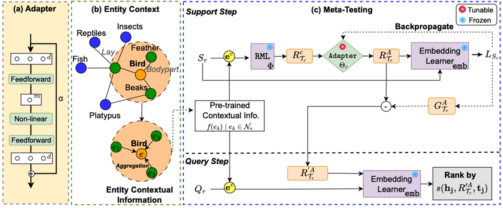

# RelAdapter (Few-shot Link Prediction)
This repo shows the source code of EMNLP 2024 paper: [Context-Aware Adapter Tuning for Few-Shot Relation Learning in Knowledge Graphs (RelAdapter)](https://arxiv.org/pdf/2410.09123) framework for few-shot relation learning (FSRL).




## Evironment Setting
This code is lastly tested with:
* Python 3.6.7
* PyTorch 1.0.1
* tensorboardX 1.8

You can also install dependencies by
```bash
pip install -r requirements.txt
```

## Dataset
We provide three datasets: UMLS, (Wiki, FB15K-237)[Visit link](https://www.dropbox.com/scl/fo/0a6776fmf6j2ga8g97i83/AAkqh13l6H4p32clNiKAUh4?rlkey=1aulevhldhp3upf1msk4sp16m&st=ewcjma77&dl=0)


## Training (UMLS)
```bash
python main.py  --seed 1  --dataset umls-One  --data_path ./umls    --few 3  --step train  --mu 0.3  --alpha 0.1 --neuron 50    --eval_by_rel False   --prefix umlsone_3shot_pretrain  --device 0
```

## Test (UMLS)
```bash
python main.py  --seed 1  --dataset umls-One  --data_path ./umls    --few 3  --step test  --mu 0.3  --alpha 0.1 --neuron 50    --eval_by_rel True --prefix umlsone_3shot_pretrain  --device 0
```
**Wiki and FB15K-237 follow the same code format for training and test**

Here are explanations of some important args,

```bash
--dataset:   "the name of dataset, Wiki, FB15K-237, UMLS"
--data_path: "directory of dataset"
--few:       "the number of few in {few}-shot, as well as instance number in support set"
--data_form: "dataset setting, Pre-Train"
--alpha : "the adapter ratio"
--mu : "the context ratio"
--neurons : "the adapter neurons"
--prefix:    "given name of current experiment"
--device:    "the GPU number"
```

## Cite (To be updated after EMNLP 2024)

```
@inproceedings{ran-etal-2024-context,
    title = "Context-Aware Adapter Tuning for Few-Shot Relation Learning in Knowledge Graphs",
    author = "Ran, Liu  and
      Liu, Zhongzhou  and
      Li, Xiaoli  and
      Fang, Yuan",
    editor = "Al-Onaizan, Yaser  and
      Bansal, Mohit  and
      Chen, Yun-Nung",
    booktitle = "Proceedings of the 2024 Conference on Empirical Methods in Natural Language Processing",
    month = nov,
    year = "2024",
    address = "Miami, Florida, USA",
    publisher = "Association for Computational Linguistics",
    url = "https://aclanthology.org/2024.emnlp-main.970",
    doi = "10.18653/v1/2024.emnlp-main.970",
    pages = "17525--17537",
    abstract = "Knowledge graphs (KGs) are instrumental in various real-world applications, yet they often suffer from incompleteness due to missing relations. To predict instances for novel relations with limited training examples, few-shot relation learning approaches have emerged, utilizing techniques such as meta-learning. However, the assumption is that novel relations in meta-testing and base relations in meta-training are independently and identically distributed, which may not hold in practice. To address the limitation, we propose RelAdapter, a context-aware adapter for few-shot relation learning in KGs designed to enhance the adaptation process in meta-learning. First, RelAdapter is equipped with a lightweight adapter module that facilitates relation-specific, tunable adaptation of meta-knowledge in a parameter-efficient manner. Second, RelAdapter is enriched with contextual information about the target relation, enabling enhanced adaptation to each distinct relation. Extensive experiments on three benchmark KGs validate the superiority of RelAdapter over state-of-the-art methods.",
}

```
